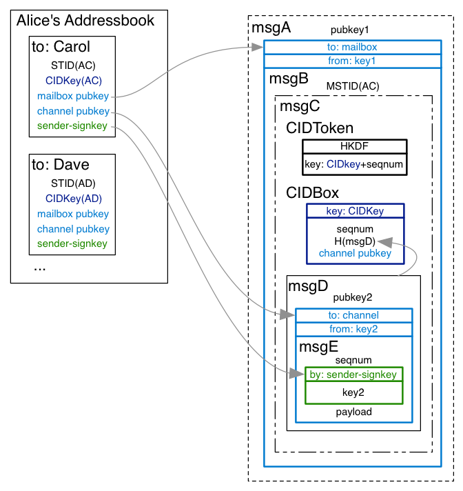
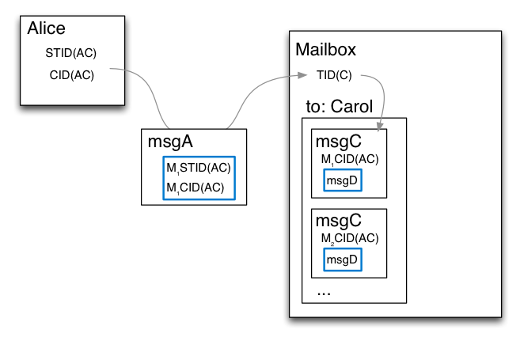
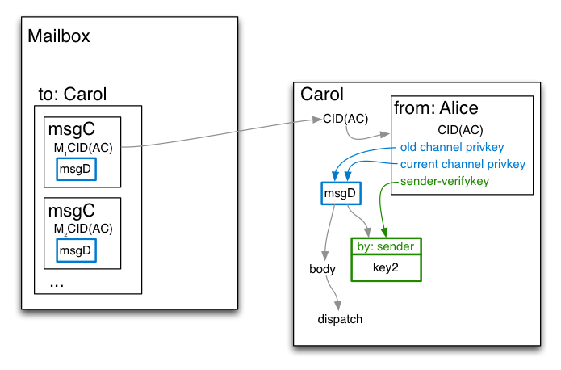

# Mailboxes

To receive messages, each client must contract with at least one `mailbox`
service. This is a publically-reachable server with good uptime, that is
willing to store incoming messages later retrieval by the client. Mailboxes
allow clients to receive messages despite not being online all the time, and
living behind a NAT box. Some mailboxes can also improve privacy by making it
difficult to link sender and receiver.

Recipients construct `transport descriptor` and `channel descriptor` strings
to instruct other nodes on how they should deliver their messages. These are
JSON-serializable data structures that always have a `type` field, and have
other fields depending upon the type. Each addressbook entry contains exactly
one channel descriptor, and one or more transport descriptors (one per
mailbox in use).

Client nodes can provide their own mailbox. This is most useful for
development, however it can be used for production when the transport
provides NAT-traversal facilities, or when the client has a public IP
address.

Clients may advertise mailboxes with transport types that are unrecognized by
other clients: these are ignored. Some transports offer realtime confirmation
of delivery, while others are high-latency send-and-hope. Senders may elect
to deliver multiple copies of their message in parallel, and receivers must
tolerate (ignore) duplicates.

## Terminology

The Players: Alice and Bob are senders. Carol and David are recipients. Both
senders have channels to both recipients (four channels in total). Each
player has a user-agent Node, which maintains an addressbook.

Channel: A unidirectional pathway for messages from one sender to one
receiver. Two nodes which have established contact will maintain two
Channels, one in each direction. Each addressbook entry contains information
on the sending side of one channel, and the receiving side of the reverse
channel. Each Channel uses a signing/verifying keypair, and a (current, old)
pair of box/unbox keypairs. The sender's entry holds the signing key and the
two pubkeys. The receiver's entry holds the verifying key and the two
privkeys. The two ends of a channel also share a CIDKey (described below),
and a duplicate-suppressing message sequence number (the sender increments a
counter, and the receiver remembers the highest seqnum they've ever seen).

Transport: A queue inside a Mailbox server, dedicated to a single receiving
Node, but shared between all Channels delivering to recipient. The Transport
ID (TID) is established when the recipient configures the mailbox, and is
known to the mailbox server

## Delivery and Retrieval

Transports have two sides. Senders interact with the "delivery" side, to add
a message to the mailbox. The recipient then uses the "retrieval" side to
fetch their stored messages. The two sides have significant differences.
Recipients may maintain a long-term connection retrieval connection to their
mailbox, to be notified about new messages quickly. Senders, on the other
hand, tend to deliver their message to the mailbox and then go away.

Some mailboxes will offer a choice of retrieval protocols. However, for many,
the delivery and retrieval protocols are closely related.

## Transport Types

The following transports are defined or planned:

* http: Delivery uses an HTTP POST message to a server. Retrieval can either
  poll with a GET (and delete processed messages with a POST), or use
  Server-Sent Events to wait for new messages. Although the Petmail agent is
  not a web browser, these protocols are reasonably well-understood, and
  enable servers to run on many convenient hosting services.

* file: (for local development) this transport uses a local subdirectory, and
  stores one message per file. Delivery simply adds a file to the directory.
  Retrieval polls for new files and deletes them after processing.

* smtp: messages are delivered as normal SMTP messages, consumed by a
  receiving node rather than by a human. Retrieval uses POP or IMAP to find,
  fetch, and delete messages.

Each transport descriptor needs to convey the following information:

* Reachability data for the mailbox. This is frequently a URL, or
  hostname/IP-address and port number. Some transports have other forms of
  indirection, so this could instead be a Tor hidden-service (.onion)
  address, or a SMTP mailbox name (username@host), or a local directory name.
* Encryption pubkey for the mailbox. This is a 32-byte Curve25519 pubkey. All
  clients who share a mailbox will use the same pubkey. This is used to
  encrypt the outer message, which will be decrypted by the mailbox. The
  intention is to conceal the ultimate recipient of each inner message from
  an eavesdropper watching the mailbox's network inlet.
* Sender-Specific Transport ID (STID). This is a re-randomizable encrypted
  token, unique to each channel. The sender will use this to create a
  per-message "MSTID", placed inside the outer-encrypted payload, so it will
  be visible to the mailbox service itself, but not to an eavesdropper.
  Mailboxes will decrypt this to obtain the (non-sender-specific) Transport
  ID (TID), which lets them determine which recipient should receive the
  message.

The channel descriptor contains the following data:

* Channel Identification Key (CIDKey): a symmetric encryption key, also
  unique to the sender+receiver pair. This is used, with a random nonce, to
  create a "CID Box": an encrypted box containing (seqnum+hash(msg)). The
  encrypted box is delivered next to the MSTID, but not decrypted by the
  mailbox server. Instead, the final recipient can perform trial decryptions
  with all CIDKeys to determine which channel the message is associated with
  (this is faster than using trial decryption of the real
  Curve25519-encrypted box). The CIDKey is also used to construct a
  "CIDToken", by hashing together the key and the message sequence number.
  This token is delivered with the CIDBox, and (as long as no messages have
  been dropped), enables the recipient to perform O(1) lookups of the
  intended channel.
* "channel-verfkey": an Ed25519 verifying key, used to authenticate messages
* "channel-pubkey-current": a Curve25519 box/unbox public key, used to
  encrypt the inner messages. This will be updated by subsequent messages, to
  provide forward-secrecy.

Multiple recipient nodes will share a mailbox service. Senders will get
distinct STID and CIDKeys for each one, but their transport reachability data
and mailbox pubkey will be the same.

Each mailbox service has a distinct pubkey. There should be a one-to-one
relationship between reachability data and mailbox pubkey.

Clients can use multiple mailbox services, or even use multiple transports
within a single mailbox. The STID will be different for each. These clients
will provide multiple transport descriptors to their correspondents. However
they will only provide a single channel descriptor to each correspondent,
regardless of how many mailboxes they use.

## Renting an Inbox

Clients must generally arrange to rent inbox space. The process for making
these arrangements is up to the individual service provider. Regardless of
how inbox service is obtained, the result is always an `inbox offer string`.
This short string should be pasted into the client node's Inbox Control
Panel. The node will then generate a transport descriptor for the inbox and
update all addressbook contacts with the new coordinates. New invitations
will include the updated descriptors.

The inbox provider is automatically added to the addressbook. They are given
the ability to deliver messages to the user. This channel allows the provider
to inform the user about service changes, and to discuss payment.

The inbox provider may find it necessary to change the transport coordinates
of the user's inbox. An additional channel, managed internally by the client
node, will receive and process these messages without user involvement.

## Retention Periods

Mailboxes are for temporary storage of inbound messages. Client nodes are
expected to retrieve their messages every few days, after which the mailbox
can delete the temporary copy. Mailboxes are allowed to delete even unread
messages after a while: the exact duration should be specified as part of the
contract (and displayed in the client UI), but is expected to be a few days
or weeks.

## Transport Security

All Petmail messages are encrypted by sender-to-recipient Curve25519
keypairs. Messages sent to a transport are additionally encrypted by a
transport-specific key, so that an eavesdropper cannot distinguish the final
recipient of the message. Eve should only learn the intended transport, and
whatever she can glean from the source of the message (e.g. source IP address
or timing information). Transport descriptors include the Curve25519 pubkey
of the transport server, and messages are encrypted using an ephemeral
sending key.

When a Tor hidden service is used as a transport, an eavesdropper should
learn even less. Hidden services offer their own strong transport security,
but for consistency we encrypt to the same mailbox key anyways. TLS/HTTPS
could offer the same properties, but only when used in a forward-secret mode,
and only if the client verifies the certificate properly, neither of which
are particularly convenient, so we use the mailbox key here too.

## Anonymity / Unlinkability

The current protocol provides limited unlinkability of messages.
Eavesdroppers do not learn anything from the contents of the inbound mailbox
messages. The mailbox observes randomized or encrypted Transport-ID and
Channel-ID values, which do not provide information about the sender of each
message (but necessarily reveal the recipient of each message, so they can
queue the message in the right place).

Both the mailbox and eavesdroppers can also use timing and source-address
information to correlate senders and their messages. It may be possible to
mitigate this by using Tor hidden services, carefully (perhaps expensively)
creating a new connection for each message, and delivering messages on a
constant-rate random schedule.

Senders can compare the mailbox reachability data and public key of their
peers, to determine if two peers might be the same. They cannot, however,
usefully compare their STID and CIDKey values (as these are different for
each sender). Two distinct recipients who both use the same mailbox host will
be indistinguishable by their correspondents. Alice and Bob have no way to
prove that Alice's peer named "Carol" is the same as Bob's peer named
"Carol", or even that "Carol" and "Dave" are different people. This only
helps if many recipients use the same mailbox service.

## Forward Secrecy

The mailbox protocol should provide `forward secrecy`, which means that old
messages cannot be decrypted by an attacker even if they learn both node's
current private state. In practice, this is difficult to obtain:

* neither sender nor recipient can keep logs of the message contents
* parts of the message may be quoted in reply messages
* node state may be included in system backups
* operating systems do not make it easy to erase data from swap partitions

However, we should at least make it possible. A user who wants proper forward
security may need to take additional steps to improve their chances of
actually getting it.

To achieve this requires the two communicating nodes to regularly rotate
their keys. A message is readble (and vulnerable to later compromise) up
until the moment that all private keys involved in its creation are securely
deleted.

Petmail senders use ephemeral keypairs when creating a message, so one of the
two private keys is discarded immediately after encryption. The recipient
must retain the corresponding private key until the last message encrypted to
it is deleted.

Recipients will periodically (but not always immediately) update their
senders with a new key.

To enable recovery from client rollback (where a client is restored from a
backup, losing the rotating keypairs but retaining the other data), Petmail
only offers forward-security for confidentiality, not authentication. If a
node's private state is revealed, the attacker may be able to retroactively
identify the sender and/or recipient of old messages. However they should not
be able to determine the contents of those messages.

## Sender Deniability / Repudiation

Senders should not have to treat their private communications as irrevocable
public statements (unless they specifically ask for that). When Alice sends a
message to Bob, Bob should be convinced of its authenticity (Alice approved
of the message contents and intended for Bob to see them), but Bob should not
be able to convince anyone else that the message came from Alice. Alice
should be able to deny authorship of the message.

To achieve this, one technique is to deliver a MAC key over a secure channel
to the recipient (so they know that only the sender could have provided it,
and nobody else knows it), then MAC each message instead of signing it. The
recipient can forge her own messages, since she knows the MAC key too, making
the author set (sender, recipient). Some systems, like OTR, go further and
publish the MAC key after confirming receipt of the message, to increase the
potential author set to be (sender, recipient, eavesdroppers). In addition,
should Bob attempt to prove a message's authenticity to a third party by
revealing the MAC key, he inevitably adds the third party to the author set
as well.

Petmail uses a technique in which the sender signs a single-use encryption
key, hidden inside the encrypted message. The innermost message is encrypted
by the Curve25519 box() function. The "to" public key is the recipient's
current (rotating) pubkey. The "from" private key is ephemeral, created by
the sender for this one message.

The inner message contains both the real payload and a signed message. The
signed body is the ephemeral pubkey used for this one message, and is made
with the sender's long-term per-channel signing key, for which the recipient
knows the corresponding verifying key (the channel-verfkey).

When Bob receives this message, he knows that Alice would only sign such a
key when she uses it to encrypt a message intended for Bob. By checking that
the inner message was encrypted with the same key as is included in the
signed message, he can be sure that the message is from Alice. An
eavesdropper (including the mailbox server) cannot see the signed message, so
they do not learn the sender's identity.

Bob could show the signed ephemeral key to a third party, who could be
convinced that Alice did indeed intend to send (somebody) a message encrypted
with the corresponding privkey. Bob can also show the boxed message, and
reveal his (rotating) private key, to show that Alice might have written the
message. But the message could be written by anyone who knows either of the
private keys, and since Bob knows his own private key, Bob could have written
that message (or indeed any message) himself.

This does not provide the large authorship set OTR gets by publishing the MAC
key, but still includes at least the recipient in the set, which is enough to
fulfill the goals of deniability. It might be possible to achieve the larger
target set by having the sender sign a MAC, which is used to authenticate the
ephemeral pubkey, and then publish the MAC key afterwards. Note that the
sender cannot safely publish their ephemeral private key, as that is also
what protects the confidentiality of the message.

## Sender Flow

Each sender creates a `transport message`, then submits it to a
transport-specific handler which is responsible for getting the message to
the mailbox.

To provide the security properties described above, the final transport
message wraps several layers of other messages. The process starts with a
`payload`, which is a message dictionary (anything that can be serialized to
JSON). The `encoded payload` is the two-byte version identifier "p1" (0x70
0x31) concatenated with the UTF8-encoded JSON-serialized payload.

The sender then uses the addressbook entry to determine:

* the channel's sender-specific transport ID (STID)
* the channel's Channel ID Key (CIDKey)
* the mailbox's stable public key (mailbox-pubkey)
* the channel's current rotating public key (channel-pubkey)
* the sender's stable signing key, for just this recipient (sender-signkey)

and creates two ephemeral keypairs pubkey1/pubkey2 (with corresponding
privkey1/privkey2). It re-randomizes STID to get MSTID, and uses CIDKey to
create the CIDBox and CIDToken. Each message gets a different MSTID, CIDBox,
and CIDToken.

The sender then builds the layered message as follows:

* msgE = seqnum + sign(by=sender-signkey, pubkey2) + encoded-payload
* msgD = pubkey2 + encrypt(to=channel-pubkey, from=privkey2, msgE)
* HmsgD = hash(msgD)
* CIDToken = HKDF(key=CIDKey+seqnum, context="petmail.org/v1/CIDToken")
* CIDBox = symbox(key=CIDKey, seqnum+HmsgD+channel-pubkey)
* msgC = CIDToken + CIDBox + msgD
* msgB = MSTID + msgC
* msgA = pubkey1 + encrypt(to=mailbox, from=privkey1, msgB)

Some notes on terminology:

* sign(by=X,msg=Y) returns the concatenation of the msg Y and the 64-byte
  Ed25519 signature (R and S concatenated together)
* symbox(key=X, Z) produces the concatenation of a 24-byte random nonce, the
  encrypted message Z, and the 32-byte Poly1305 MAC. This is built by
  concatenating the nonce and the output of crypto_secretbox().
* encrypt(to=X, from=Y, Z) produces the concatenation of a 24-byte random
  nonce, the encrypted message Z, and the 32-byte Poly1305 MAC. This is built
  by concatenating the nonce and the output of crypto_box().

## Wire Protocol

To deliver transport messages ("msgA" above) via the HTTP transport, an HTTP
POST is performed to the mailbox's URL. The payload of the request contains
the following:

* A two-byte version indicator, "v1" (0x76 0x31)
* msgA, which contains:

  * 32-byte sender ephemeral pubkey (pubkey1)
  * 24-byte nonce
  * encrypted msgB
  * 32-byte MAC

Once the POST is complete, the server uses the mailbox privkey and pubkey1 to
decrypt the message and obtain msgB.

It then splits msgB into MSTID the inner msgC. It decrypts MSTID to obtain
the non-sender-specific non-message-specific yes-recipient-specific TID,
looks up the matching message queue, and enqueues msgC to that queue. If the
TID is unrecognized, it returns an error.

When the message has been safely queued, the HTTP response of "200 OK" is
returned. If an error occurs (bad MAC, unrecognized MSTID, disk full), a "400
BAD_REQUEST" is returned, and the sender should try again later or through a
different mailbox. Other transports (non-connection oriented) can log
successes and errors but do not (and cannot) inform the sender.

## Client Flow

The recipient contacts the mailbox and retrieves any queued messages intended
for its client identifier, using a protocol that depends on the mailbox type.
It gets the full contents of "msgC" as described above. The client then
instructs the mailbox to delete the queued messages. If the client maintains
multiple queues with the same mailbox service (e.g. multiple TIDs), it must
retrieve each set of messages separately.

The recipient extracts CIDToken from the message and compares it against a
table of pre-computed tokens for all channels that use this mailbox. It then
trial-decrypts the CIDBox with the CIDKey for all channels, or just the one
channel if the CIDToken found a match. Finally it trial-decrypts msgD with
both channel pubkeys (old and new) for all channels (or just the one channel
for which CIDToken matched). If a decrypted CIDToken reveals a seqnum that is
not greater than the highest seqnum seen on this channel, or the seqnum in
msgE does not meet this criteria, or if the two seqnums are different, the
message is logged and discarded (as a duplicate, or a malformed message).

Any valid message can be handled by trial decryption, at the cost of
2*len(channels) `crypto_box_open()` operations. In (probably) all cases, this
can be reduced to len(channels) `crypto_secretbox_open()` operations, which
is significantly faster. And in nearly all cases (excepting when messages are
dropped), it can be reduced to a single table lookup (of the CIDToken).

Once the right channel is found, and msgD decrypted to obtain msgE, the
recipient uses the channel's sender-verifykey to check the internal signature
of pubkey2, and asserts that the internal key2 matches the one used to
encrypt msgD. (This protective binding may be redundant: a later version of
this protocol might remove the signature).

If the "current" channel privkey was able to decrypt the message, the channel
keys should be rotated: the old key forgotten, the current key renamed to
"old", and a new key created and named "current". The next time a message is
sent, the new key should be included in the payload. Key rotation alone
should not trigger a new message, otherwise the process would never converge.

The encoded payload is then checked for the leading "p1" version string, and
logged+discarded (with a "unrecognized payload version" message) if it is not
present. Then the rest of the encoded payload is UTF8-decoded and
JSON-unserialized, and the resulting payload object is delivered to the
Dispatcher for routing. Some messages are intended for the user, others are
consumed internally for maintenance purposes; this is determined by fields
inside the payload object.
